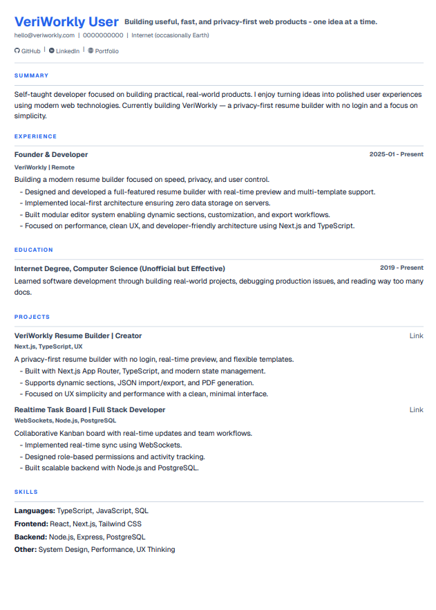
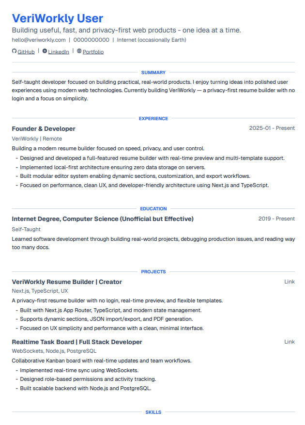
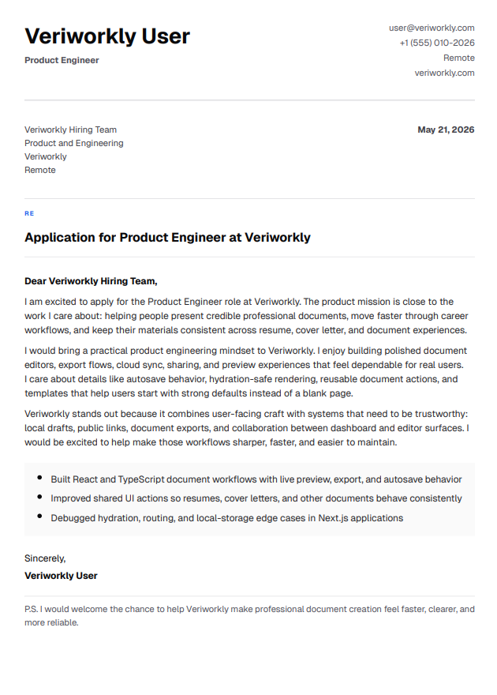
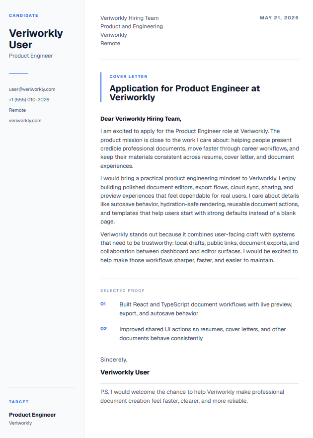

<div align="center">
  <a href="https://veriworkly.com">
    
  </a>

  <br />
  <br />

  <h1>🚀 VeriWorkly Resume</h1>

  <p><strong>Professional, privacy-first, and open-source career document engineering platform.</strong></p>

  <p>
    <a href="https://veriworkly.com">✨ Main Application</a>
    ·
    <a href="https://docs.veriworkly.com">📖 Documentation</a>
    ·
    <a href="https://blog.veriworkly.com">📰 Official Blog</a>
    ·
    <a href="https://veriworkly.com/roadmap">🗺️ Product Roadmap</a>
  </p>

  <p>
    
    
    
  </p>
</div>

---

## 🎯 Executive Summary

VeriWorkly is a **high-performance, privacy-centric resume building ecosystem** designed to challenge the traditional surveillance-heavy SaaS resume builder model. Operating on the **Local-First principle**, VeriWorkly stores all your career data directly in your browser. It combines a state-of-the-art Next.js frontend with a lightweight Node.js/Express backend to provide a seamless, secure, and professional document generation experience.

---

## ✨ Key Capabilities

- **⚡ Real-Time Rendering**: Edit details and see your ATS-optimized resume update instantly with pixel-perfect visual previews.
- **🔒 Local-First Storage**: Your data stays on your machine. No mandatory accounts, tracking cookies, or remote server locks.
- **📥 Universal Exports**: One-click downloads to ATS-optimized PDF and editable DOCX formats.
- **☁️ Optional Cloud Sync**: Secure, end-to-end synchronized account support for access across multiple devices.
- **🔧 API Extensibility**: Fully integrated and documented OpenAPI specification to plug in external tools.

---

## 🎨 Premium Templates

### Resume Templates

<table width="100%">
  <tr>
    <td align="center" width="50%">
      
      <br /><strong>Precision ATS</strong>
    </td>
    <td align="center" width="50%">
      
      <br /><strong>Executive Clarity</strong>
    </td>
  </tr>
</table>

### Cover Letter Templates

<table width="100%">
  <tr>
    <td align="center" width="50%">
      
      <br /><strong>Professional Classic</strong>
    </td>
    <td align="center" width="50%">
      
      <br /><strong>VeriWorkly Special</strong>
    </td>
  </tr>
</table>

---

## ⚙️ Architecture & Tech Stack

VeriWorkly uses a type-safe **monorepo** layout to ensure clean service isolation and high developer velocity.

```
veriworkly-resume/
├── apps/
│   ├── site/             # Marketing & Landing Site (Next.js)
│   ├── studio/           # Dynamic Builder App & Workspace (Next.js)
│   ├── server/           # Express API & Sync backend (NodeJS)
│   ├── docs-platform/    # Technical Documentation Hub (Fumadocs)
│   └── blog-platform/    # Official Product Blog (Next.js)
└── packages/
    └── ui/               # Shared UI Design System & Component Library
```

| Layer                     | Technologies Used                                 |
| :------------------------ | :------------------------------------------------ |
| **Frontend Applications** | Next.js 15 (App Router), React 19, Tailwind CSS 4 |
| **Backend API**           | Node.js, Express, TypeScript                      |
| **Data Persistence**      | PostgreSQL (Prisma ORM)                           |
| **Rendering Pipeline**    | react-pdf (Client-side high-fidelity generation)  |
| **Authentication**        | Better-Auth (Passwordless OTP)                    |
| **State Management**      | Zustand (with localStorage persistence)           |

---

## 🚀 Quick Start Guide

### Local Development Setup

To run VeriWorkly locally on your system, follow these commands:

1. **Clone the Repo & Install Dependencies**

   ```bash
   git clone https://github.com/VeriWorkly/veriworkly.git
   cd veriworkly-resume
   npm install
   ```

2. **Configure Environment Variables**

   ```bash
   cp .env.example .env
   cp apps/server/.env.example apps/server/.env
   ```

3. **Deploy Local Database migrations**

   ```bash
   npm run db:push -w @veriworkly/server
   ```

4. **Launch Dev Environment**
   ```bash
   npm run dev
   ```

### Running with Docker

Deploy the complete ecosystem (database, backend server, and frontend client) instantly via Docker Compose:

```bash
docker compose --env-file .env.docker up -d --build
```

---

## 📖 Documentation Directory

| Resource                    | Description                                          | Location                                                        |
| :-------------------------- | :--------------------------------------------------- | :-------------------------------------------------------------- |
| **Technical Documentation** | Monorepo architecture, API Reference, deployment.    | [docs.veriworkly.com](https://docs.veriworkly.com)              |
| **User Support & Guides**   | Walkthroughs for editing, building and templates.    | [User Guides Hub](https://docs.veriworkly.com/docs/user-guides) |
| **Manual Setup Guide**      | Standard local environment installation.             | [README.Local.md](README.Local.md)                              |
| **Docker Operations**       | Configuration, environment variables, orchestration. | [README.Docker.md](README.Docker.md)                            |
| **Contributing Guide**      | Repository protocols, standards, and git guidelines. | [CONTRIBUTING.md](CONTRIBUTING.md)                              |

---

## 🤝 Contributing

VeriWorkly is built on open-source principles, and we welcome community contributions!

> [!IMPORTANT]
> Before checking out a branch or creating a pull request, please review our full **[Contributing Guidelines](CONTRIBUTING.md)**.
>
> 1. 🌟 **Star the repository** to show your support.
> 2. 📋 **Claim an issue** by commenting on it and waiting to be assigned before starting work.
> 3. 📝 Ensure your **PR titles** follow the standard naming convention.

### Ways to Help Out

1. **Code**: Implement new features, performance improvements, or address open issues.
2. **Design**: Build and submit new ATS-optimized resume templates.
3. **Docs**: Refine explanations, fix typos, or add code setup examples.
4. **Feedback**: File bugs or suggest future features on our product roadmap.

---

## 🔒 Security & Privacy

We take security and user data privacy very seriously:

- **Local-First Architecture**: Your resumes reside locally in your browser storage.
- **Zero Behaviors Tracking**: We collect no user analytics, mouse tracking, or heatmaps.
- **Vulnerability Disclosure**: If you discover a security issue, please do **not** file a public GitHub issue. Email us privately at `info@veriworkly.com` with steps to reproduce. Read [SECURITY.md](SECURITY.md) for more info.

---

## 📄 License

VeriWorkly is released under the [MIT License](LICENSE).

---

<div align="center">
  <h3>Made with ❤️ by the VeriWorkly Team and our amazing community of contributors</h3>
</div>
