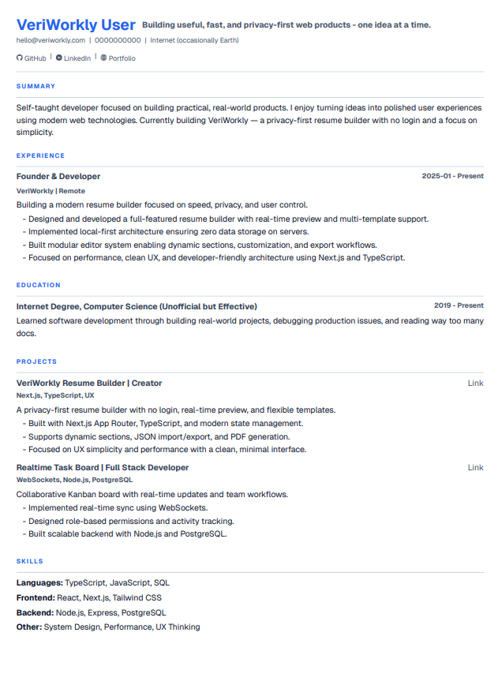
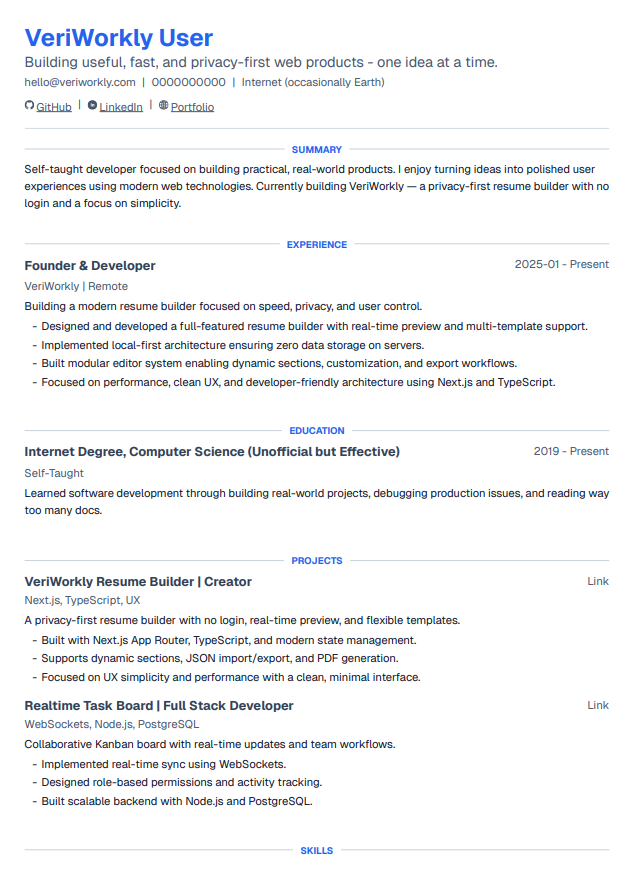

<div align="center">
  <a href="https://veriworkly.com">
    
  </a>

  <br />
  <br />

  <h1>🚀 VeriWorkly</h1>

  <p><strong>Professional, privacy-first, and open-source career workspace & document engineering platform.</strong></p>

  <p>
    <a href="https://veriworkly.com">✨ Main Application</a>
    ·
    <a href="https://docs.veriworkly.com">📖 Documentation</a>
    ·
    <a href="https://blog.veriworkly.com">📰 Official Blog</a>
    ·
    <a href="https://veriworkly.com/roadmap">🗺️ Product Roadmap</a>
  </p>

  <p>
    
    
    
  </p>
</div>

---

## 🎯 System Overview

VeriWorkly is a **local-first career workspace ecosystem**: a resume and cover letter builder, a public portfolio website builder, an ATS scoring engine, AI-assisted writing tools, and GitHub/LinkedIn import utilities — all centered around a single, canonical **Master Profile**.

Instead of mandatory logins and data tracking, VeriWorkly operates on a **local-first principle**: documents reside in your browser (`localStorage`) by default, requiring no account to build, edit, or export. Logged-in users unlock cloud synchronization, per-document revision control, AI features, ATS deep analysis, and custom portfolio publishing on `*.veriworkly.com` subdomains.

---

## ✨ Key Capabilities

- **⚡ Local-First Engine & Instant Previews**: Build resumes, cover letters, and portfolios in real time with client-side state management (Zustand + `localStorage`). Guest sessions persist via a 30-day HttpOnly cookie (`veriworkly-guest-mode`).
- **🧠 Canonical Master Profile**: Maintain one authoritative record of your career history that automatically seeds new resumes, cover letters, and portfolios without mutating your core profile facts.
- **🌐 Portfolio Platform**: Create, customize, and publish personal websites across templates (Signal, Atelier, Nimbus, Cipher) with custom subdomains or path routing (`portfolio.veriworkly.com/portfolio/{username}`).
- **🤖 Deterministic & AI ATS Scoring**: Analyze resumes against target job descriptions with keyword optimization, extraction quotas, and AI-assisted rewriting (routed dynamically across Anthropic Claude & OpenAI GPT models).
- **📥 Client-Side Dual Engine Exports**: Generate high-fidelity PDFs (`@react-pdf/renderer`), Word documents (`docx`), HTML, Markdown, Plain Text, and JSON directly in the browser — **zero headless browser (Puppeteer) server dependencies**.
- **☁️ Cloud Sync & Conflict Resolution**: Synchronize documents securely via Express and PostgreSQL with revision counters, optimistic concurrency, conflict resolution, and per-document "keep local only" opt-outs.
- **🔧 OpenAPI & Developer API**: Extensible backend with scoped API keys — explore interactive OpenAPI documentation at [docs.veriworkly.com/api-reference](https://docs.veriworkly.com/api-reference).

---

## 🎨 Resume & Cover Letter Templates

### Resume Templates

<table width="100%">
  <tr>
    <td align="center" width="50%">
      
      <br /><strong>Precision ATS</strong>
    </td>
    <td align="center" width="50%">
      
      <br /><strong>Executive Clarity</strong>
    </td>
  </tr>
  <tr>
    <td align="center" width="50%">
      
      <br /><strong>Bold Impact</strong>
    </td>
    <td align="center" width="50%">
      
      <br /><strong>Modern Minimal</strong>
    </td>
  </tr>
</table>

---

## ⚙️ Architecture & Monorepo Layout

VeriWorkly uses an **npm workspaces monorepo** consisting of **6 applications** and **1 shared design system package**:

```
veriworkly/
├── apps/
│   ├── site/             # [Port 3000] Marketing & Landing Site (Next.js 16)
│   ├── studio/           # [Port 3001] Document Builder, Master Profile, ATS & Admin (Next.js 16)
│   ├── docs-platform/    # [Port 3002] Technical Documentation & OpenAPI Hub (Next.js 16 / Fumadocs)
│   ├── blog-platform/    # [Port 3003] Official Product & Engineering Blog (Next.js 16 / Fumadocs)
│   ├── portfolio/        # [Port 3004] Portfolio Builder, Gallery & Subdomain Publisher (Next.js 16)
│   └── server/           # [Port 8080] Express 4 API, Sync Engine & Background Jobs (Node.js 20+)
└── packages/
    └── ui/               # In-house Shared Design System & Components (@veriworkly/ui)
```

### Technology Stack

| Component              | Technology                  | Description                                                                      |
| :--------------------- | :-------------------------- | :------------------------------------------------------------------------------- |
| **Frontend Framework** | **Next.js 16 (App Router)** | React 19 meta-framework with SSR & route handlers across all 5 frontends         |
| **Styling & Tokens**   | **Tailwind CSS 4**          | Utility-first CSS using native `@theme` directives & shared design tokens        |
| **Design System**      | **`@veriworkly/ui`**        | In-house UI component primitives & layout shells (no Radix or MUI dependencies)  |
| **State & Storage**    | **Zustand**                 | Lightweight frontend state management, persisted to browser `localStorage`       |
| **PDF Generation**     | **`@react-pdf/renderer`**   | Pure client-side high-fidelity PDF rendering engine                              |
| **DOCX Generation**    | **`docx`**                  | Client-side Microsoft Word document generator                                    |
| **Backend Runtime**    | **Node.js 20+**             | TypeScript Express 4 server, clustered with `throng` in production               |
| **Database & ORM**     | **PostgreSQL + Prisma 7**   | Type-safe relational database storage & migrations                               |
| **Cache & Queues**     | **Redis**                   | Auth sessions, rate limiting, ATS quotas, view counts, and distributed job locks |
| **Authentication**     | **Better-Auth**             | Passwordless Email OTP plus Google, GitHub, and LinkedIn OAuth providers         |
| **File Parsing**       | **`pdf-parse`, `mammoth`**  | Server-side text extraction for PDF and Word resume uploads                      |
| **Payments**           | **Dodo Payments**           | Credit purchases, subscription management, and billing portal                    |
| **Object Storage**     | **Cloudflare R2**           | Presigned S3-compatible image uploads for custom portfolios                      |
| **Background Tasks**   | **`node-cron`**             | 5 automated background cron jobs guarded by Redis distributed locks              |
| **Docs & Search**      | **Fumadocs + MDX**          | Content engine powering documentation, API reference, and blog platform          |

---

## 🚀 Local Development Setup

### Prerequisites

- **Node.js**: v20.19.0 or higher (Node.js 22 supported)
- **npm**: Repository uses npm workspaces (`npm install` from root)
- **PostgreSQL**: Required for backend API functionality ([Neon](https://neon.tech) managed Postgres supported)
- **Redis**: Required for backend sessions, rate limiting, quotas, and job locking

> [!TIP]
> **Frontend-Only Development**: You can run `apps/site` or `apps/studio` independently without PostgreSQL or Redis if you are working purely on UI, layout, or resume templates.

### Quick Start Instructions

1. **Clone the Repository & Install Dependencies**

   ```bash
   git clone https://github.com/VeriWorkly/veriworkly.git
   cd veriworkly
   npm install
   ```

2. **Configure Environment Files**

   ```bash
   cp .env.example .env
   cp apps/server/.env.example apps/server/.env
   cp apps/site/.env.example apps/site/.env
   cp apps/studio/.env.example apps/studio/.env
   cp apps/portfolio/.env.example apps/portfolio/.env
   cp apps/docs-platform/.env.example apps/docs-platform/.env
   cp apps/blog-platform/.env.example apps/blog-platform/.env
   ```

3. **Initialize Database Schema**

   ```bash
   npm run db:push
   npm run db:generate
   ```

4. **Launch Development Servers**

   **Launch all services simultaneously**:

   ```bash
   npm run dev:all
   ```

   **Or run specific application workspaces individually**:

   ```bash
   npm run dev            # Marketing Site    → http://localhost:3000
   npm run dev:studio     # Document Builder  → http://localhost:3001
   npm run dev:docs       # Technical Docs    → http://localhost:3002
   npm run dev:blog       # Product Blog      → http://localhost:3003
   npm run dev:portfolio  # Portfolio Builder → http://localhost:3004
   npm run dev:server     # Express API       → http://localhost:8080
   ```

---

## 🛠️ Verification & Useful Scripts

### Service Probes & Health Check

| Endpoint          | URL                                                                                    | Purpose                                                       |
| :---------------- | :------------------------------------------------------------------------------------- | :------------------------------------------------------------ |
| **API Liveness**  | [http://localhost:8080/api/v1/health](http://localhost:8080/api/v1/health)             | Lightweight HTTP server liveness check                        |
| **API Readiness** | [http://localhost:8080/api/v1/health/ready](http://localhost:8080/api/v1/health/ready) | Probes active PostgreSQL database and Redis cache connections |

### Testing & Quality Commands

```bash
# Code style & formatting verification
npm run lint
npm run format:write

# Server backend tests (Vitest)
npm test -w @veriworkly/server

# Application unit & contract test suites (Vitest)
npm run test:contracts -w @veriworkly/studio
npm run test:browser -w @veriworkly/studio
npm run test:contracts -w @veriworkly/site
npm test -w @veriworkly/portfolio

# PDF / Preview Parity Test Suite (requires Playwright Chromium)
npm run test:parity -w @veriworkly/studio

# Verify complete monorepo build pipeline
npm run build
```

---

## 📖 Documentation Directory

| Topic                     | Description                                                            | Link / Location                                                                                                      |
| :------------------------ | :--------------------------------------------------------------------- | :------------------------------------------------------------------------------------------------------------------- |
| **System Overview**       | Architecture overview, export pipeline, and technical specs.           | [docs.veriworkly.com/docs/overview](https://docs.veriworkly.com/docs/overview)                                       |
| **Monorepo Architecture** | Application layout, routing proxy, and private template submodule.     | [docs.veriworkly.com/docs/architecture/monorepo](https://docs.veriworkly.com/docs/architecture/monorepo)             |
| **API Reference**         | OpenAPI 3.0 specification & interactive developer reference endpoints. | [docs.veriworkly.com/api-reference](https://docs.veriworkly.com/api-reference)                                       |
| **Local Setup Guide**     | Environment variables, database initialization, and dev servers.       | [docs.veriworkly.com/docs/getting-started/local-setup](https://docs.veriworkly.com/docs/getting-started/local-setup) |
| **Docker Operations**     | Orchestration, Docker Compose, and deployment parameters.              | [README.Docker.md](README.Docker.md)                                                                                 |
| **Contributing Protocol** | Issue claiming, PR naming conventions, and repository standards.       | [CONTRIBUTING.md](CONTRIBUTING.md)                                                                                   |

---

## 🤝 Contributing

We welcome community contributions! Please follow our guidelines when getting involved:

> [!IMPORTANT]
>
> 1. 🌟 **Star the repository** to support open-source development.
> 2. 📋 **Claim an issue** by commenting on it and waiting to be officially assigned before starting work.
> 3. 📝 Follow conventional commit naming standards (`feat:`, `fix:`, `docs:`, `refactor:`).
> 4. Read the full **[Contributing Guidelines](CONTRIBUTING.md)** prior to opening a Pull Request.

---

## 🔒 Security & Privacy

- **Local-First Privacy**: Your document data remains stored in your local browser environment by default.
- **Zero Behavioral Tracking**: No heatmaps, mouse tracking, or third-party behavioral telemetry. Aggregate-only product telemetry is used exclusively for service performance analysis.
- **Responsible Disclosure**: If you find a security vulnerability, please email `info@veriworkly.com` directly instead of opening a public issue. Review [SECURITY.md](SECURITY.md) for complete details.

---

## 📄 License

VeriWorkly is open-source software licensed under the [MIT License](LICENSE).

<div align="center">
  <br />
  <h3>Built with ❤️ by the VeriWorkly Team and our open-source community</h3>
</div>
